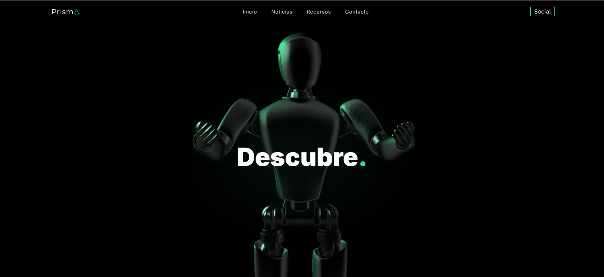

# Proyecto-Prisma
Es un proyecto de final del módulo de Lenguaje de Marcas de primero de Desarrollo de Aplicaciones Web (DAW)

[Link]([https://www.ejemplo.com](https://proyecto-prisma.netlify.app/))

